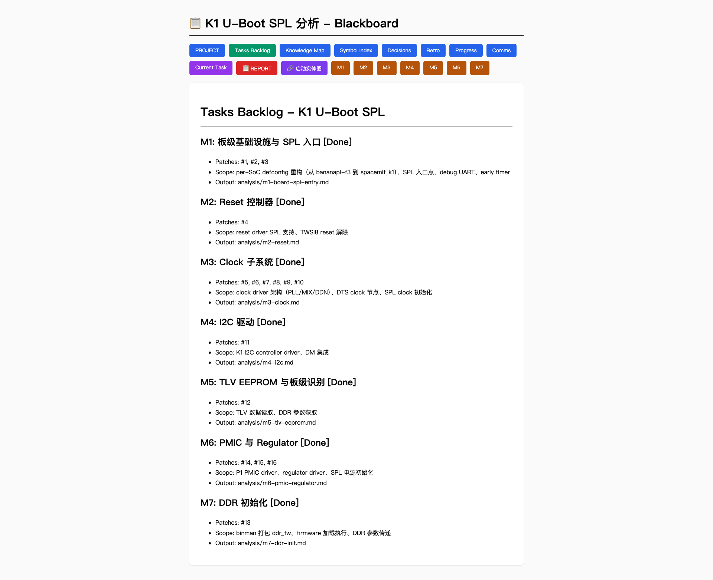

# 🔬 Source-Driven Code Analysis Multi-Agent Framework

A multi-agent framework designed for deep code reverse engineering and architecture analysis.

In software development, we use Spec-Driven agents to write code. But in reverse engineering and source code analysis, we need **Source-Driven** agents - where the source code itself is the single source of truth.

This framework introduces **"No Evidence, No Claim"** and **anti-Analysis Hypnosis** mechanisms to tackle million-line-scale C/C++ system code analysis.

Looking for code **development** instead of analysis? Check out [agent-TRIO](https://github.com/docularxu/agent-TRIO) - same team structure, but for spec-driven software development. **No Doc, No Code** instead of No Evidence, No Claim.

## Table of Contents

- [Core Design Principles](#-core-design-principles)
- [The Agent Team](#-the-agent-team)
- [Quick Start](#-quick-start)
- [Repository Structure](#-repository-structure)
- [Experience Accumulation](#-experience-accumulation)
- [Three-Phase Workflow](#three-phase-workflow)
- [Real-World Example: SpacemiT K1 U-Boot SPL](#real-world-example-spacemit-k1-u-boot-spl)
- [Origin](#origin)
- [License](#license)

## 🌟 Core Design Principles

1. **No Evidence, No Claim**: Every business logic assertion must be accompanied by a precise physical code reference `[file:line]`. No reference, no claim.

2. **Zero-Trust Review**: The Reviewer agent verifies code citations by going back to the source code and checking the actual lines referenced. No claim is accepted at face value.

3. **Progressive Knowledge Graph**: Instead of single-pass large-context reads, the framework uses a shared blackboard (`tasks-backlog` + `knowledge-map`) to progressively piece together the global architecture, module by module.

4. **Blackboard State Machine**: All workflow progression is driven by file-based state tags (`[TODO]` → `[Analyzing]` → `[Reviewing]` → `[Done]`), not by agent memory. This enables crash recovery and deterministic flow control.

5. **Protocol Layering**: Agent identity (SOUL.md) is separated from workflow rules (PROTOCOL.md). The protocol is automatically injected into every agent session via AGENTS.md, ensuring agents follow the design - not a compressed summary of it.

6. **Built-in Observability**: Every state change and agent-to-agent message is logged to physical files (`progress.md`, `a2a-comms-log.md`). A web dashboard (`index.html`) renders all blackboard files in real-time, giving the human engineer full visibility into what the agents are doing, what they've decided, and where things stand - without reading raw logs.


*Real example: K1 U-Boot SPL analysis dashboard showing 7 completed modules, task backlog, knowledge map, and observability logs.*

## 👥 The Agent Team

A "permanent team, rotating projects" approach - the agents persist across projects, accumulating expertise over time.

- **⚡ Jarvis-Arch (Architect)**: Scouts the codebase, splits modules, controls token budget, manages the knowledge graph, and arbitrates conflicts. Drives the state machine.

- **🔬 Researcher (Code Archaeologist)**: Traces call chains, tracks data flow mutations, reports implicit jumps (`[UNRESOLVED]`). Believes only in what the compiler executes, not what comments say.

- **🔍 Reviewer (Logic Judge)**: Assumes all reports contain hallucinations until proven otherwise. Uses reverse verification, shadow tracking, and context toxicity checks to catch errors.

## 🚀 Quick Start

### Prerequisites

- [OpenClaw](https://github.com/openclaw/openclaw) installed and running (`openclaw gateway start`)
- An LLM provider configured (Anthropic, Google, OpenAI, etc.)

There are two ways to deploy:

**Option A: Let your AI agent do it.** Clone this repo, then tell your existing AI agent:

> "Read the README at `~/source-TRIO/`. Set up the three agents (Jarvis-Arch, Researcher, Reviewer) with their SOUL.md, AGENTS.md, shared PROTOCOL.md, and guard.sh. Configure communication and verify everything works."

Your agent reads this repo, executes all the steps below, and reports back. You describe the intent, the agent handles the rest. This is how deployment works in the AI agent era.

**Option B: Do it yourself.** The detailed steps below are written so that either an AI agent or a human can follow them. If you prefer hands-on control, or if your agent needs a reference, here they are:

### 1. Deploy the Team

Clone this repo. Create the agents and deploy all files:

```bash
# Create agents
openclaw agents add jarvis-arch --model <your-model-id>
openclaw agents add researcher --model <your-model-id>
openclaw agents add reviewer --model <your-model-id>

# Deploy shared protocol, templates (one copy, shared by all agents)
mkdir -p ~/.openclaw/agents/shared/
cp PROTOCOL.md ~/.openclaw/agents/shared/PROTOCOL.md
cp guard.sh    ~/.openclaw/agents/shared/guard.sh
cp -r templates/ ~/.openclaw/agents/shared/templates/

# Deploy per-agent files (SOUL.md + AGENTS.md + symlinks)
for agent in jarvis-arch researcher reviewer; do
  cp agents/$agent/SOUL.md    ~/.openclaw/agents/$agent/SOUL.md
  cp agents/$agent/AGENTS.md  ~/.openclaw/agents/$agent/AGENTS.md
  ln -sf ~/.openclaw/agents/shared/PROTOCOL.md ~/.openclaw/agents/$agent/PROTOCOL.md
  ln -sf ~/.openclaw/agents/shared/guard.sh    ~/.openclaw/agents/$agent/guard.sh
done
```

Each agent gets:
- **SOUL.md** - Identity and personality ("who you are")
- **AGENTS.md** - Auto-injected startup instructions (points to PROTOCOL.md)
- **PROTOCOL.md** - Workflow protocol, state machine rules, communication sequences (symlink to shared copy)
- **guard.sh** - Code-level enforcement for critical rules (symlink to shared copy)

See `configs/openclaw-example.yaml` for a full configuration example with model choices and tool permissions.

### Upgrading (Existing Users)

If agents are already deployed and you've pulled a new version of this repo, update the framework files **without losing runtime data** (MEMORY.md, sessions, .blackboard).

**Option A: Let your AI agent do it.**

> "Read the Upgrading section in `~/source-TRIO/README.md` and execute it. Update all three agents' framework files without touching runtime data."

**Option B: Do it yourself.**

```bash
cd ~/path/to/source-TRIO   # your local clone

# Update shared protocol + templates
mkdir -p ~/.openclaw/agents/shared/
cp PROTOCOL.md ~/.openclaw/agents/shared/PROTOCOL.md
cp guard.sh    ~/.openclaw/agents/shared/guard.sh
cp -r templates/ ~/.openclaw/agents/shared/templates/

# Update per-agent framework files (SOUL.md + AGENTS.md + symlinks)
for agent in jarvis-arch researcher reviewer; do
  cp agents/$agent/SOUL.md   ~/.openclaw/agents/$agent/SOUL.md
  cp agents/$agent/AGENTS.md ~/.openclaw/agents/$agent/AGENTS.md
  ln -sf ~/.openclaw/agents/shared/PROTOCOL.md ~/.openclaw/agents/$agent/PROTOCOL.md
  ln -sf ~/.openclaw/agents/shared/guard.sh    ~/.openclaw/agents/$agent/guard.sh
done
```

**Overwritten** (framework files): SOUL.md, AGENTS.md, PROTOCOL.md (symlink), guard.sh (symlink)

**Preserved** (runtime data): MEMORY.md, memory/, .blackboard/, sessions/, TOOLS.md, IDENTITY.md

### 2. Verify Agent Communication

Before starting real work, run a quick smoke test to confirm all three agents can talk to each other:

```
You → Jarvis-Arch:  "Ping Researcher and Reviewer, confirm communication."
```

Expected result:
- Jarvis-Arch sends a message to Researcher → Researcher acknowledges
- Jarvis-Arch sends a message to Reviewer → Reviewer acknowledges
- Jarvis-Arch reports back: "All agents online, communication verified."

If any link fails, check `subagents.allowAgents` in your OpenClaw config (see `configs/openclaw-example.yaml`).

### 3. Start Analyzing

Point Jarvis-Arch to a source code project (an existing local clone or a GitHub repo URL):

> "Analyze the dummy-c-project at example_workspace/dummy-c-project/. Focus on tracing the init flow in main() to find out which hardware register address is actually being operated on."

Jarvis-Arch will handle the rest (Phase 1 - Reconnaissance):
1. Align the analysis scope with you through conversation
2. Initialize the project workspace (`.blackboard/`, `PROJECT.md`, etc.)
3. Scout the codebase, produce `PROJECT.md` + `SYMBOL_INDEX.md`
4. Submit the plan to Reviewer, then ask you for sign-off

After sign-off, Phase 2 begins automatically:
5. Dispatch modules to Researcher, trigger Reviewer for verification
6. Integrate results into `knowledge-map.md`

From this point on, you don't need the git clone anymore. Everything the agents need is deployed in their workspaces.

### 4. See It in Action

`example_workspace/dummy-c-project/` contains a 3-file C project with deliberate traps (function pointer dispatch, macro obfuscation, dead code). Point your agents at it and run the full workflow.

After your agents finish, compare your results against `example_output/dummy-c-project/` - the reference output from a real live-fire exercise.

## 📁 Repository Structure

```
source-TRIO/
├── README.md
├── LICENSE
├── PROTOCOL.md                     # Workflow protocol (deployed to shared/)
├── guard.sh                        # State-change enforcement script
├── agents/                         # Agent definitions (SOUL.md + AGENTS.md)
│   ├── jarvis-arch/
│   │   ├── SOUL.md                 #   Identity: Architect / Coordinator
│   │   └── AGENTS.md               #   Startup instructions (→ PROTOCOL.md)
│   ├── researcher/
│   │   ├── SOUL.md                 #   Identity: Code Archaeologist
│   │   └── AGENTS.md               #   Startup instructions (→ PROTOCOL.md)
│   └── reviewer/
│       ├── SOUL.md                 #   Identity: Logic Judge
│       └── AGENTS.md               #   Startup instructions (→ PROTOCOL.md)
├── configs/
│   └── openclaw-example.yaml       # OpenClaw engine configuration example
├── templates/                      # Blank templates for project workspace
│   ├── PROJECT.md
│   ├── blackboard/
│   │   ├── tasks-backlog.md
│   │   ├── task.md
│   │   ├── knowledge-map.md
│   │   ├── review.md
│   │   ├── decisions.md
│   │   └── retro.md
│   └── analysis/
│       └── NN-module-name.md
├── docs/
│   └── design-architecture.html    # Full design document (interactive)
├── example_workspace/              # Test target - clean source code, no output
│   └── dummy-c-project/
│       ├── README.md               # Trap descriptions and expected results
│       ├── main.c                  # Entry point with implicit dispatch
│       ├── driver_api.h            # Interface contract + dead code decoy
│       └── usb_driver.c            # Real implementation + macro obfuscation
└── example_output/                 # Reference output - compare after your run
    └── dummy-c-project/
        └── .blackboard/
            ├── PROJECT.md          # Project overview (generated by Jarvis-Arch)
            ├── SYMBOL_INDEX.md     # Global symbol table
            ├── tasks-backlog.md    # Task list with final states
            ├── knowledge-map.md    # Knowledge graph
            ├── REPORT.md           # Final integrated report
            └── analysis/
                ├── task-01-init-flow.md     # Analysis task definition
                ├── report-01-init-flow.md   # Researcher's analysis report
                └── review-01-init-flow.md   # Reviewer's verification record
```

### Deployed File Layout

After deployment, each agent's workspace looks like:

```
~/.openclaw/agents/shared/
├── PROTOCOL.md                     # Single source of truth for workflow rules
├── guard.sh                        # State-change enforcement
└── templates/                      # Project workspace templates
    ├── PROJECT.md                  #   (copied to .blackboard/ at Phase 1)
    └── blackboard/                 #   tasks-backlog, knowledge-map, etc.

~/.openclaw/agents/jarvis-arch/     # (researcher/ and reviewer/ same structure)
├── SOUL.md                         # Identity (copied)
├── AGENTS.md                       # Startup instructions (copied)
├── PROTOCOL.md                     # → symlink → shared/PROTOCOL.md
└── guard.sh                        # → symlink → shared/guard.sh
```

## 💡 Experience Accumulation

"Permanent team, rotating projects." When a project wraps up, don't delete the agents. Append lessons learned to each agent's `MEMORY.md` (SOUL.md is read-only - only the human owner modifies it). Your team gets sharper with every project.

## 🔧 Maintaining the Framework

The design source of truth is `docs/design-architecture.html`. PROTOCOL.md is derived from it.

**Any workflow change must follow this order:**
1. **First** update `docs/design-architecture.html` (the design source)
2. **Then** sync the change to `PROTOCOL.md` (the agent-readable version)

Never modify PROTOCOL.md first. Design source is upstream, PROTOCOL is downstream.

## Three-Phase Workflow


| Phase | Input | Output | Gate |
|-------|-------|--------|------|
| **1. Reconnaissance** | Analysis target + codebase access | PROJECT.md, tasks-backlog.md, knowledge-map.md (initial), SYMBOL_INDEX.md | Reviewer pass + Owner sign-off |
| **2. Deep Dive** (per module) | task.md + knowledge-map + source code | analysis/NN-module.md, review.md, knowledge-map (updated) | Reviewer pass (≤3 rounds) |
| **3. Final Report** | All analysis/*.md + knowledge-map (final) | REPORT.md | Owner sign-off |

## Real-World Example: SpacemiT K1 U-Boot SPL

A full live-fire analysis of [SpacemiT K1 U-Boot SPL patchset](https://lore.kernel.org/u-boot/20260210151459.2348758-1-raymondmaoca@gmail.com/) (17 patches, complete SPL bring-up chain).

- 🇨🇳 [K1 SPL 启动实体图](https://docularxu.github.io/source-TRIO/examples/k1-spl-boot-entities-cn.html)
- 🇺🇸 [K1 SPL Boot Entities](https://docularxu.github.io/source-TRIO/examples/k1-spl-boot-entities-en.html)
- 🇨🇳 [完整对话记录（带批注）](https://docularxu.github.io/source-TRIO/examples/k1-spl-conversation-cn.html)
- 🇺🇸 [Full Conversation Log (Annotated)](https://docularxu.github.io/source-TRIO/examples/k1-spl-conversation-en.html)

## Origin

This framework was designed through a collaboration between a human (20+ years kernel dev) and AI agents. The core insight: **AI analyzing code without evidence constraints produces plausible-sounding hallucinations. Force every claim to carry a `[file:line]` reference, add zero-trust review, and analysis quality transforms.**

## License

MIT

---

*Designed by Guodong Xu - [docularxu](https://github.com/docularxu)*
