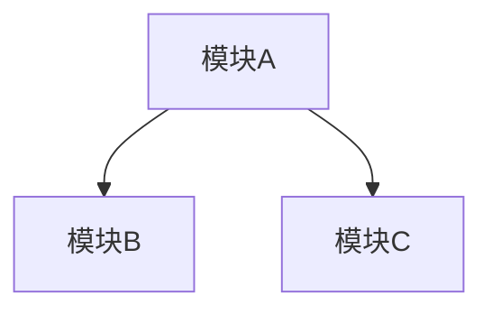

# 知识图谱 - [项目名]

## 模块关系图

## 已确认结论
### 模块 A (analysis/01-module-a.md)
- [C1] [结论1]（引用: file:line）→ 被引用: 模块B, 模块C
- [C2] [结论2]（引用: file:line）→ 被引用: 无

## 需要重审 [Needs Re-evaluation]
- [ ] (模块名) - 原因: (哪条结论被修正)

## 开放问题
- [ ] 问题1 - 需要分析模块 D 后才能回答
- [ ] 问题2 - 需要硬件手册

## 修正记录
- [日期] 分析模块 X 时发现模块 Y 的 xxx 结论需修正（原因: ...）

## 术语表
- (缩写): (全称/含义)
